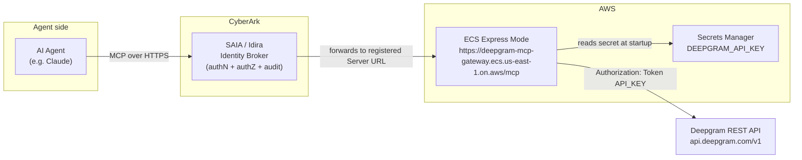

# Deepgram Agentic Tools — MCP Server for CyberArk Secure AI Agents (SAIA)

A small, self-hosted **Model Context Protocol (MCP)** server that exposes Deepgram's
core developer tools — speech-to-text, text-to-speech, text intelligence, model
listing, and usage — so an AI agent can call them **through CyberArk Secure AI
Agents (SAIA / Idira)**, with the CyberArk Identity Broker enforcing and auditing
access.

It speaks **Streamable HTTP** MCP and is deployed to **Amazon ECS Express Mode**
for a permanent, stable HTTPS endpoint that is compliant with corporate network
security policies.

---

## Table of contents

- [Why this project exists](#why-this-project-exists)
- [What it does](#what-it-does)
- [Architecture](#architecture)
- [Authentication model (why "None" in SAIA)](#authentication-model-why-none-in-saia)
- [Prerequisites](#prerequisites)
- [AWS ECS Express Mode deployment (recommended)](#aws-ecs-express-mode-deployment-recommended)
- [Local development (optional)](#local-development-optional)
- [Registering the server in SAIA](#registering-the-server-in-saia)
- [Testing with Claude](#testing-with-claude)
- [The tools](#the-tools)
- [Corporate TLS inspection / `truststore`](#corporate-tls-inspection--truststore)
- [Troubleshooting](#troubleshooting)
- [Repository layout](#repository-layout)
- [Security notes](#security-notes)
- [Appendix: the Deepgram "docs MCP" red herring](#appendix-the-deepgram-docs-mcp-red-herring)

---

## Why this project exists

The goal was to demo CyberArk's **Secure AI Agents (SAIA)** brokering an agent's
access to a real third-party MCP server — specifically Deepgram's speech tools
(`transcribe_audio`, `synthesize_speech`, `analyze_text`, `list_models`,
`get_usage`).

During setup we discovered two things that make a purpose-built server necessary:

1. **Deepgram's published `deepgram-mcp` package and `dg mcp` CLI do not actually
   serve those agentic tools.** Both proxy to `https://api.dx.deepgram.com/kapa/mcp`,
   which is Deepgram's **documentation Q&A** server (powered by kapa.ai). A live
   `tools/list` against it returns exactly one tool:
   `search_deepgram_knowledge_sources`. See the
   [appendix](#appendix-the-deepgram-docs-mcp-red-herring) for the evidence.

2. **SAIA registers _remote_ MCP servers by URL** (it discovers the server over
   HTTPS and requires either OAuth 2.1 or "None" auth). Deepgram's real speech
   tools are only reachable via its **REST API** with an API key — there is no
   hosted MCP endpoint for them.

So this project **wraps Deepgram's REST API in a proper MCP server** that we
self-host and expose over HTTPS, then register in SAIA. This is also the cleanest
SAIA story: the underlying server has no user-facing auth, so **CyberArk becomes
the authorization + audit layer.**

## What it does

`deepgram_tools_mcp.py` is a FastMCP (Streamable HTTP) server that exposes five
tools, each a thin wrapper over a Deepgram REST endpoint:

| MCP tool            | Deepgram REST call                     | Purpose                              |
| ------------------- | -------------------------------------- | ------------------------------------ |
| `transcribe_audio`  | `POST /v1/listen`                      | Speech-to-text (URL or local file)   |
| `synthesize_speech` | `POST /v1/speak`                       | Text-to-speech (Aura), saved to disk |
| `analyze_text`      | `POST /v1/read`                        | Summary, sentiment, topics, intents  |
| `list_models`       | `GET /v1/models`                       | List STT/TTS models                  |
| `get_usage`         | `GET /v1/projects/{id}/usage`          | Account usage (needs `usage:read`)   |

The Deepgram API key is held **server-side** (from `.env`) and is never exposed to
the agent or the MCP client.

## Architecture



Request flow: the agent talks to CyberArk; CyberArk authenticates, authorizes, and
audits the request, then forwards the MCP call to the registered **Server URL** (the
ECS Express Mode HTTPS endpoint); the container runs the MCP server which calls
Deepgram's REST API using the API key injected from Secrets Manager.

## Why ngrok is required

SAIA registers **remote** MCP servers — it needs a **publicly reachable HTTPS URL**
that its Identity Broker (running in CyberArk's cloud) can call. The MCP server in
this repo runs **locally** on `127.0.0.1:8787`, which CyberArk cannot reach.

**ngrok bridges that gap.** It opens a secure outbound tunnel from your machine to
ngrok's edge and gives you a public `https://<random>.ngrok-free.dev` URL that
forwards inbound requests to your local server. This lets you demo a locally-hosted
MCP server through SAIA without deploying to a cloud host, opening firewall ports,
or provisioning a TLS certificate (ngrok terminates TLS at its edge).

Notes and alternatives:

- **The free ngrok URL changes on every restart.** Re-paste the new URL into SAIA
  after each restart, or use a **reserved ngrok domain** (`NGROK_DOMAIN=... ./run.sh`)
  to keep it stable.
- ngrok is a **demo/dev convenience**, not a production requirement. For a
  persistent deployment, host the server on any HTTPS-reachable endpoint
  (Cloud Run, a VM behind a reverse proxy, etc.) and register that URL instead.
- Any equivalent tunnel (Cloudflare Tunnel, Tailscale Funnel) would also work.

## Authentication model (why "None" in SAIA)


SAIA supports two auth methods for a registered MCP server: **OAuth 2.1** or **None**.

- This server intentionally exposes **no OAuth** on the MCP layer. When SAIA runs
  discovery, the server returns no `WWW-Authenticate` challenge, so SAIA classifies
  it as **Authentication = None**.
- With **None**, CyberArk's Identity Broker becomes the authorization service:
  every agent call is authenticated, authorized, and audited by CyberArk before it
  reaches the server. The human user, the agent identity, the tool used, and the
  target server are all captured in CyberArk's audit trail.
- The Deepgram credential (API key) lives only on the server and is never seen by
  the agent — CyberArk governs *whether the agent may call the tool at all*.

This is the intended demo narrative: **CyberArk secures and audits access to an
otherwise-unauthenticated MCP server.**

## Prerequisites

- A **Deepgram API key** — free at <https://console.deepgram.com>
- An **AWS account** with permissions to use ECS, ECR, CodeBuild, IAM, and Secrets Manager
- AWS CLI configured (automatic in CloudShell; or `aws configure` locally)
- No local Docker needed — CodeBuild builds the image in AWS

## AWS ECS Express Mode deployment (recommended)

Amazon ECS Express Mode gives you a **permanent HTTPS URL**, auto-provisioned
Application Load Balancer, TLS certificate, autoscaling, and CloudWatch logging —
all from a single `deploy.sh` run. No servers to manage, no tunnelling tools.

> **Why ECS Express Mode?** AWS App Runner (the previous solution) stopped accepting
> new customers in April 2026. ECS Express Mode is the AWS-recommended replacement
> with the same "deploy a container, get an HTTPS URL" simplicity.

### One command from AWS CloudShell

Open **AWS CloudShell** from the AWS Console (the terminal icon in the top navigation
bar). Then:

```bash
git clone https://github.com/ChadPapineau/deepgram-mcp-gateway
cd deepgram-mcp-gateway
bash deploy.sh
```

The script prompts for:

| Prompt | What to enter |
|--------|---------------|
| AWS Region | e.g. `us-east-1` (or press Enter for your configured default) |
| Service name | e.g. `deepgram-mcp-gateway` |
| GitHub repo URL | `https://github.com/ChadPapineau/deepgram-mcp-gateway` |
| Branch | `main` |
| Deepgram API key | Your key — stored in Secrets Manager, never committed |

**What `deploy.sh` provisions automatically:**

1. **ECR repository** — stores the Docker container image
2. **CodeBuild project** — pulls from GitHub, runs `docker build`, pushes to ECR  
   *(no local Docker required)*
3. **Secrets Manager secret** — holds `DEEPGRAM_API_KEY` securely
4. **Two IAM roles** — ECS task execution role and ECS infrastructure role
5. **ECS Express Mode service** — Fargate container behind an ALB with auto-HTTPS

When complete (~7–10 minutes total), it prints:

```
╔══════════════════════════════════════════════════════════════╗
║   Deployment complete!                                        ║
║                                                               ║
║  MCP endpoint:  https://deepgram-mcp-gateway.ecs.us-east-1.on.aws/mcp
║                                                               ║
║  Steps to register in CyberArk SAIA (Idira):                 ║
║    1. Open SAIA → Register MCP server                         ║
║    2. Paste the URL above into 'Server URL'                   ║
║    3. Click Discover → Auth method should be 'None'           ║
║    4. Fill in name / category and click Register              ║
╚══════════════════════════════════════════════════════════════╝
```

### Redeploying after code changes

The image is not automatically rebuilt on `git push` — re-run `bash deploy.sh` any
time you want a fresh image built from the latest commit.

### Rotating the Deepgram API key

Re-run `bash deploy.sh` and enter the new key when prompted. The script updates
Secrets Manager and triggers a fresh deployment.

### Stopping / deleting the service

```bash
# Find the service ARN
aws ecs list-services --cluster default --region YOUR_REGION \
  --query "serviceArns[?contains(@,'deepgram-mcp-gateway')]" --output text

# Delete the ECS service
aws ecs delete-express-gateway-service --service-arn YOUR_SERVICE_ARN \
  --region YOUR_REGION

# Optionally clean up the ECR image and CodeBuild project
aws ecr delete-repository --repository-name deepgram-mcp-gateway \
  --force --region YOUR_REGION
aws codebuild delete-project --name deepgram-mcp-gateway-build --region YOUR_REGION
```

---

## Local development (optional)

For development and testing only — **not for production or corporate use**.

```bash
# 1) Clone and install
git clone https://github.com/ChadPapineau/deepgram-mcp-gateway
cd deepgram-mcp-gateway
python3 -m venv --copies venv
./venv/bin/pip install -r requirements.txt

# 2) Add your Deepgram API key
echo 'DEEPGRAM_API_KEY=your_key_here' > .env

# 3) Start the server locally
./venv/bin/python deepgram_tools_mcp.py --host 127.0.0.1 --port 8787
```

**Quick local self-test:**

```bash
curl -s -X POST http://127.0.0.1:8787/mcp \
  -H "Content-Type: application/json" \
  -H "Accept: application/json, text/event-stream" \
  -d '{"jsonrpc":"2.0","id":1,"method":"tools/list","params":{}}'
```

**Health check:**

```bash
curl http://127.0.0.1:8787/health
# → {"status":"ok","server":"deepgram-mcp-gateway"}
```

**Stopping the server:**

```bash
pkill -f deepgram_tools_mcp
```

## Registering the server in SAIA

1. In SAIA, open **Register MCP server**.
2. **MCP server name:** e.g. `DeepgramTools`.
3. **Server URL:** the ngrok URL from `run.sh`, ending in `/mcp`.
4. Click **Discover**. It should set **Authentication method = None**.
5. Fill in Category / Owners / Tags as desired and click **Register**.
6. Connect the server to your AI agent. The agent will now see all five tools.

If **Discover** fails or demands OAuth metadata, the server can be extended with a
`.well-known/oauth-protected-resource` discovery route; open an issue / ask before
adding it, since a plain "None" server generally should not advertise OAuth.

## Testing with Claude

After registering the MCP server in SAIA and adding the Deepgram connector in
claude.ai, use these prompts to verify each tool. Every call is brokered and
audited by CyberArk.

**1. Transcribe audio (speech-to-text)**
> "Transcribe this recording and give me the text: https://dpgr.am/spacewalk.wav"

Exercises `transcribe_audio`. Returns the full transcript and confidence score.

**2. Transcribe + summarize**
> "Transcribe https://dpgr.am/spacewalk.wav and summarize the key points in three
> bullet points."

Exercises `transcribe_audio` with `summarize: true`, then Claude summarises the
result.

**3. Text-to-speech**
> "Use Deepgram to convert this text to speech with the Aura voice: 'Welcome to
> the Secure AI Agents demo, powered by CyberArk and Deepgram.'"

Exercises `synthesize_speech`. Saves an MP3 to `output/` on the server. Play it
locally with:
```bash
afplay output/speech_*.mp3
```

**4. Text intelligence**
> "Analyze the sentiment and main topics of this text: 'The onboarding was rough
> at first, but support was fantastic and the API latency is incredible.'"

Exercises `analyze_text`. Returns sentiment score and extracted topics.

**5. Model discovery**
> "What Deepgram speech-to-text and text-to-speech models are available?"

Exercises `list_models`. Returns the full STT/TTS model catalog.

> **Tip:** After running any of these, show the corresponding entries in CyberArk's
> audit trail — human user → agent identity → tool used → target server — to make
> the SAIA value proposition land in the demo.

---

## The tools

Example arguments (all callable via MCP `tools/call`):

- **`transcribe_audio`** — `{ "url": "https://dpgr.am/spacewalk.wav", "model": "nova-3", "smart_format": true, "diarize": false, "summarize": false }`
  (or `{ "file_path": "/path/to/audio.wav" }`). Returns transcript, confidence, and duration.
- **`synthesize_speech`** — `{ "text": "Hello world", "model": "aura-2-thalia-en" }`.
  Writes an MP3 to `output/` and returns the file path and byte size.
- **`analyze_text`** — `{ "text": "…", "language": "en", "summarize": true, "sentiment": true, "topics": true, "intents": false }`.
- **`list_models`** — no args. Returns STT and TTS model lists.
- **`get_usage`** — `{ "start": "2026-06-01", "end": "2026-07-01" }` (both optional).
  Requires an API key with the `usage:read` scope (Owner/Admin role); otherwise it
  returns a clear "insufficient_permissions" message instead of failing.

## Corporate TLS inspection / `truststore`

On corporate networks (e.g., with a TLS-inspection proxy), Python's default
`certifi` CA bundle does **not** include the corporate root CA, so outbound HTTPS
from Python fails with `CERTIFICATE_VERIFY_FAILED: self-signed certificate in
certificate chain` — even though `curl` works (it uses the OS keychain).

This project uses the [`truststore`](https://pypi.org/project/truststore/) package
and calls `truststore.inject_into_ssl()` at startup so Python uses the **operating
system trust store** (which includes your corporate root CA). If you're on a plain
network this is a harmless no-op.

## Troubleshooting

| Symptom | Cause / Fix |
| ------- | ----------- |
| Claude says "connector's server errored out" | ECS service may be deploying or unhealthy. Check **ECS console → Clusters → default → Services → deepgram-mcp-gateway**. |
| `deploy.sh` CodeBuild step fails | Check logs in **CodeBuild console → Projects → deepgram-mcp-gateway-build → Build history**. Common cause: repo URL typo or GitHub unauthenticated access to a private repo. |
| Private GitHub repo — CodeBuild can't pull | Add a GitHub personal access token to Secrets Manager and configure it as a CodeBuild source credential. Contact the repo admin for access. |
| ECS service stuck in `PENDING` / never `ACTIVE` | IAM role propagation can take 1–2 minutes. If it persists, check ECS task logs in CloudWatch Logs (`/ecs/deepgram-mcp-gateway`). |
| Health check failing → tasks cycling | Confirm `/health` returns HTTP 200: `curl https://YOUR_URL/health`. |
| `[Errno 2] No such file or directory` (local dev only) | Stale SSL context after machine sleep. Restart: `pkill -f deepgram_tools_mcp && ./venv/bin/python deepgram_tools_mcp.py`. |
| `SSL: CERTIFICATE_VERIFY_FAILED` (local dev only) | Corporate TLS inspection proxy. Handled by `truststore`; ensure it's installed (`pip install -r requirements.txt`). |
| `get_usage` returns `insufficient_permissions` | API key lacks `usage:read` scope. Create an Owner/Admin key in the Deepgram console, then re-run `deploy.sh`. |
| SAIA "discovery failed" on registration | Confirm the URL ends in `/mcp` and `curl -X POST https://YOUR_URL/mcp` returns HTTP 200. |
| `AccessDenied` creating IAM roles in deploy.sh | Your AWS user needs `iam:CreateRole`, `iam:PutRolePolicy`, `iam:AttachRolePolicy`, `iam:GetRole`. Ask your AWS admin. |

## Repository layout

```
.
├── deepgram_tools_mcp.py          # MCP server (5 tools, Streamable HTTP + /health)
├── deploy.sh                      # Interactive AWS ECS Express Mode deploy script
├── buildspec.yml                  # CodeBuild spec: docker build + push to ECR
├── Dockerfile                     # Container image definition
├── requirements.txt               # Python dependencies
├── run.sh                         # Local development launcher (not for production)
├── list_deepgram_mcp_tools.py     # Diagnostic: proves kapa endpoint is docs-only
├── register-deepgram-oauth-client.sh  # (Optional) DCR helper for Deepgram OAuth docs endpoint
├── README.md
├── .gitignore
├── .env.example                   # Template — copy to .env for local dev
├── .env                           # NOT committed — holds DEEPGRAM_API_KEY (local dev only)
├── venv/                          # NOT committed — local Python venv
└── output/                        # NOT committed — generated TTS audio (local dev)
```

## Security notes

- **Never commit `.env`** (it holds your Deepgram API key). It is git-ignored.
- In the AWS deployment, the API key is stored in **Secrets Manager** — not in the
  repo, not in plain-text ECS configuration, and not in any log.
- The API key stays server-side; it is never sent to the agent or MCP client.
- The ECS Express Mode HTTPS URL is unauthenticated at the MCP layer — access control
  is enforced by CyberArk SAIA. Share the URL only through the SAIA registration;
  do not paste it in public channels.
- ECS Express Mode uses an internet-facing Application Load Balancer. All traffic
  uses standard AWS-provided TLS (no tunnelling tool involved).
- If a key is ever exposed, rotate it in the Deepgram console and re-run `deploy.sh`.

## Appendix: the Deepgram "docs MCP" red herring

Deepgram's docs advertise a `dg mcp` / `deepgram-mcp` server with tools like
`transcribe_audio`. In practice, the shipped code (`deepgram-mcp` 0.1.1 and
`deepctl`'s `deepctl_cmd_mcp`) both call the same `run_proxy()` that connects to:

```
https://api.dx.deepgram.com/kapa/mcp
```

A live `tools/list` against that endpoint (authenticated with a Deepgram API key)
returns a single tool:

```
search_deepgram_knowledge_sources  — semantic retrieval over Deepgram's docs
```

That endpoint also identifies itself as `deepgram-mcp-relay` and is the kapa.ai
documentation assistant — **not** the speech tools. `list_deepgram_mcp_tools.py` in
this repo reproduces that check. This is why we wrap the REST API ourselves rather
than reusing Deepgram's MCP package.

> Separately, `https://api.dx.deepgram.com/kapa/mcp` *is* a fully OAuth 2.1–compliant
> MCP resource (RFC 9728 protected-resource metadata, dynamic client registration at
> `https://id.dx.deepgram.com/register`). `register-deepgram-oauth-client.sh` can
> register an OAuth client there — but it only unlocks the **docs** tool, so it's not
> used in this demo.
