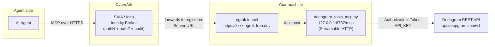

# Deepgram Agentic Tools — MCP Server for CyberArk Secure AI Agents (SAIA)

A small, self-hosted **Model Context Protocol (MCP)** server that exposes Deepgram's
core developer tools — speech-to-text, text-to-speech, text intelligence, model
listing, and usage — so an AI agent can call them **through CyberArk Secure AI
Agents (SAIA / Idira)**, with the CyberArk Identity Broker enforcing and auditing
access.

It speaks **Streamable HTTP** MCP and is exposed to SAIA over an **HTTPS tunnel
(ngrok)**.

---

## Table of contents

- [Why this project exists](#why-this-project-exists)
- [What it does](#what-it-does)
- [Architecture](#architecture)
- [Why ngrok is required](#why-ngrok-is-required)
- [Authentication model (why "None" in SAIA)](#authentication-model-why-none-in-saia)
- [Prerequisites](#prerequisites)
- [Setup](#setup)
- [Running it](#running-it)
- [Registering the server in SAIA](#registering-the-server-in-saia)
- [The tools](#the-tools)
- [Corporate TLS inspection / `truststore`](#corporate-tls-inspection--truststore)
- [Troubleshooting](#troubleshooting)
- [Repository layout](#repository-layout)
- [Security notes](#security-notes)
- [Appendix: the Deepgram "docs MCP" red herring](#appendix-the-deepgram-docs-mcp-red-herring)

---

## Why this project exists

The goal was to demo CyberArk's **Secure AI Agents (SAIA)** brokering an agent's
access to a real third-party MCP server — specifically Deepgram's speech tools
(`transcribe_audio`, `synthesize_speech`, `analyze_text`, `list_models`,
`get_usage`).

During setup we discovered two things that make a purpose-built server necessary:

1. **Deepgram's published `deepgram-mcp` package and `dg mcp` CLI do not actually
   serve those agentic tools.** Both proxy to `https://api.dx.deepgram.com/kapa/mcp`,
   which is Deepgram's **documentation Q&A** server (powered by kapa.ai). A live
   `tools/list` against it returns exactly one tool:
   `search_deepgram_knowledge_sources`. See the
   [appendix](#appendix-the-deepgram-docs-mcp-red-herring) for the evidence.

2. **SAIA registers _remote_ MCP servers by URL** (it discovers the server over
   HTTPS and requires either OAuth 2.1 or "None" auth). Deepgram's real speech
   tools are only reachable via its **REST API** with an API key — there is no
   hosted MCP endpoint for them.

So this project **wraps Deepgram's REST API in a proper MCP server** that we
self-host and expose over HTTPS, then register in SAIA. This is also the cleanest
SAIA story: the underlying server has no user-facing auth, so **CyberArk becomes
the authorization + audit layer.**

## What it does

`deepgram_tools_mcp.py` is a FastMCP (Streamable HTTP) server that exposes five
tools, each a thin wrapper over a Deepgram REST endpoint:

| MCP tool            | Deepgram REST call                     | Purpose                              |
| ------------------- | -------------------------------------- | ------------------------------------ |
| `transcribe_audio`  | `POST /v1/listen`                      | Speech-to-text (URL or local file)   |
| `synthesize_speech` | `POST /v1/speak`                       | Text-to-speech (Aura), saved to disk |
| `analyze_text`      | `POST /v1/read`                        | Summary, sentiment, topics, intents  |
| `list_models`       | `GET /v1/models`                       | List STT/TTS models                  |
| `get_usage`         | `GET /v1/projects/{id}/usage`          | Account usage (needs `usage:read`)   |

The Deepgram API key is held **server-side** (from `.env`) and is never exposed to
the agent or the MCP client.

## Architecture



Request flow: the agent talks to CyberArk; CyberArk authenticates/authorizes/audits
and forwards the MCP call to the registered **Server URL** (the ngrok HTTPS URL);
ngrok forwards to the local MCP server; the server calls Deepgram's REST API using
the server-held API key and returns the result back up the chain.

## Why ngrok is required

SAIA registers **remote** MCP servers — it needs a **publicly reachable HTTPS URL**
that its Identity Broker (running in CyberArk's cloud) can call. The MCP server in
this repo runs **locally** on `127.0.0.1:8787`, which CyberArk cannot reach.

**ngrok bridges that gap.** It opens a secure outbound tunnel from your machine to
ngrok's edge and gives you a public `https://<random>.ngrok-free.dev` URL that
forwards inbound requests to your local server. This lets you demo a locally-hosted
MCP server through SAIA without deploying to a cloud host, opening firewall ports,
or provisioning a TLS certificate (ngrok terminates TLS at its edge).

Notes and alternatives:

- **The free ngrok URL changes on every restart.** Re-paste the new URL into SAIA
  after each restart, or use a **reserved ngrok domain** (`NGROK_DOMAIN=... ./run.sh`)
  to keep it stable.
- ngrok is a **demo/dev convenience**, not a production requirement. For a
  persistent deployment, host the server on any HTTPS-reachable endpoint
  (Cloud Run, a VM behind a reverse proxy, etc.) and register that URL instead.
- Any equivalent tunnel (Cloudflare Tunnel, Tailscale Funnel) would also work.

## Authentication model (why "None" in SAIA)

SAIA supports two auth methods for a registered MCP server: **OAuth 2.1** or **None**.

- This server intentionally exposes **no OAuth** on the MCP layer. When SAIA runs
  discovery, the server returns no `WWW-Authenticate` challenge, so SAIA classifies
  it as **Authentication = None**.
- With **None**, CyberArk's Identity Broker becomes the authorization service:
  every agent call is authenticated, authorized, and audited by CyberArk before it
  reaches the server. The human user, the agent identity, the tool used, and the
  target server are all captured in CyberArk's audit trail.
- The Deepgram credential (API key) lives only on the server and is never seen by
  the agent — CyberArk governs *whether the agent may call the tool at all*.

This is the intended demo narrative: **CyberArk secures and audits access to an
otherwise-unauthenticated MCP server.**

## Prerequisites

- **Python 3.11+** (developed on 3.14)
- A **Deepgram API key** — free at <https://console.deepgram.com>
- An **ngrok account + auth token** — free at <https://dashboard.ngrok.com/signup>
- The `ngrok` binary (see setup)

## Setup

```bash
# 1) Clone and enter the repo
git clone <your-repo-url>
cd Deepgram

# 2) Create a virtual environment and install dependencies
python3 -m venv --copies venv
./venv/bin/python -m pip install --upgrade pip
./venv/bin/python -m pip install -r requirements.txt

# 3) Provide your Deepgram API key (kept out of git by .gitignore)
echo 'DEEPGRAM_API_KEY=your_deepgram_key_here' > .env

# 4) Install ngrok and register your auth token
#    macOS (Homebrew):  brew install --cask ngrok
#    or download from:  https://ngrok.com/download
ngrok config add-authtoken YOUR_NGROK_TOKEN
```

> `run.sh` auto-detects `ngrok` from your `PATH`. If needed, override with
> `NGROK_BIN=/full/path/to/ngrok ./run.sh`.

## Running it

**One command (recommended):**

```bash
./run.sh
```

This starts the MCP server and the ngrok tunnel, waits for the public URL, and
prints the exact **Server URL** to paste into SAIA, e.g.:

```
============================================================
  Deepgram MCP is live.

  Paste this into SAIA -> Register MCP server -> Server URL:

      https://xxxx-xxxx-xxxx.ngrok-free.dev/mcp

  Authentication method: None (CyberArk brokers/audits access)
============================================================
```

Pin a stable domain (optional):

```bash
NGROK_DOMAIN=your-name.ngrok.app ./run.sh
```

**Manual (two terminals):**

```bash
# terminal 1 — the MCP server
./venv/bin/python deepgram_tools_mcp.py --host 127.0.0.1 --port 8787

# terminal 2 — the tunnel
ngrok http 8787
# then read the https URL from ngrok's dashboard or http://127.0.0.1:4040
```

**Quick local self-test (no SAIA needed):**

```bash
curl -s -X POST http://127.0.0.1:8787/mcp \
  -H "Content-Type: application/json" \
  -H "Accept: application/json, text/event-stream" \
  -d '{"jsonrpc":"2.0","id":1,"method":"tools/list","params":{}}'
```

## Registering the server in SAIA

1. In SAIA, open **Register MCP server**.
2. **MCP server name:** e.g. `DeepgramTools`.
3. **Server URL:** the ngrok URL from `run.sh`, ending in `/mcp`.
4. Click **Discover**. It should set **Authentication method = None**.
5. Fill in Category / Owners / Tags as desired and click **Register**.
6. Connect the server to your AI agent. The agent will now see all five tools.

If **Discover** fails or demands OAuth metadata, the server can be extended with a
`.well-known/oauth-protected-resource` discovery route; open an issue / ask before
adding it, since a plain "None" server generally should not advertise OAuth.

## The tools

Example arguments (all callable via MCP `tools/call`):

- **`transcribe_audio`** — `{ "url": "https://dpgr.am/spacewalk.wav", "model": "nova-3", "smart_format": true, "diarize": false, "summarize": false }`
  (or `{ "file_path": "/path/to/audio.wav" }`). Returns transcript, confidence, and duration.
- **`synthesize_speech`** — `{ "text": "Hello world", "model": "aura-2-thalia-en" }`.
  Writes an MP3 to `output/` and returns the file path and byte size.
- **`analyze_text`** — `{ "text": "…", "language": "en", "summarize": true, "sentiment": true, "topics": true, "intents": false }`.
- **`list_models`** — no args. Returns STT and TTS model lists.
- **`get_usage`** — `{ "start": "2026-06-01", "end": "2026-07-01" }` (both optional).
  Requires an API key with the `usage:read` scope (Owner/Admin role); otherwise it
  returns a clear "insufficient_permissions" message instead of failing.

## Corporate TLS inspection / `truststore`

On corporate networks (e.g., with a TLS-inspection proxy), Python's default
`certifi` CA bundle does **not** include the corporate root CA, so outbound HTTPS
from Python fails with `CERTIFICATE_VERIFY_FAILED: self-signed certificate in
certificate chain` — even though `curl` works (it uses the OS keychain).

This project uses the [`truststore`](https://pypi.org/project/truststore/) package
and calls `truststore.inject_into_ssl()` at startup so Python uses the **operating
system trust store** (which includes your corporate root CA). If you're on a plain
network this is a harmless no-op.

## Troubleshooting

| Symptom                                                              | Cause / Fix                                                                                                   |
| ------------------------------------------------------------------- | ------------------------------------------------------------------------------------------------------------ |
| `421 Invalid Host header` through ngrok                              | MCP DNS-rebinding host validation. Already disabled in this server via `TransportSecuritySettings`.           |
| `SSL: CERTIFICATE_VERIFY_FAILED ... self-signed certificate`         | Corporate TLS inspection. Handled by `truststore`; ensure it's installed (`pip install -r requirements.txt`). |
| `get_usage` returns `insufficient_permissions`                      | API key lacks `usage:read`. Create an Owner/Admin key in the Deepgram console.                                |
| `analyze_text` 400 "missing field `language`"                        | `language` is required for `/v1/read`; the server sends `en` by default.                                      |
| ngrok URL stopped working                                            | Free URLs change on restart. Re-run `run.sh` and re-paste the URL, or use a reserved domain.                  |
| SAIA "discovery failed"                                              | Confirm the URL ends in `/mcp` and the tunnel is up (`curl` the `/mcp` endpoint). Ask about the `.well-known` shim if needed. |

## Repository layout

```
.
├── deepgram_tools_mcp.py          # The MCP server (5 tools, Streamable HTTP)
├── run.sh                         # Start server + ngrok, print the SAIA URL
├── requirements.txt               # Python dependencies
├── list_deepgram_mcp_tools.py     # Diagnostic: proves kapa endpoint is docs-only
├── register-deepgram-oauth-client.sh  # (Optional) DCR helper for Deepgram's OAuth docs endpoint
├── README.md
├── .gitignore
├── .env                           # NOT committed — holds DEEPGRAM_API_KEY
├── venv/                          # NOT committed
└── output/                        # NOT committed — generated TTS audio
```

## Security notes

- **Never commit `.env`** (it holds your Deepgram API key). It is git-ignored.
- The API key stays server-side; it is never sent to the agent or MCP client.
- ngrok exposes your local server to the public internet while running. The URL is
  unguessable but unauthenticated at the tunnel layer — in the SAIA demo, access
  control is enforced by CyberArk. Stop the tunnel (`Ctrl+C`) when not demoing, and
  don't leave it running unattended.
- If a key is ever exposed, rotate it in the Deepgram console.

## Appendix: the Deepgram "docs MCP" red herring

Deepgram's docs advertise a `dg mcp` / `deepgram-mcp` server with tools like
`transcribe_audio`. In practice, the shipped code (`deepgram-mcp` 0.1.1 and
`deepctl`'s `deepctl_cmd_mcp`) both call the same `run_proxy()` that connects to:

```
https://api.dx.deepgram.com/kapa/mcp
```

A live `tools/list` against that endpoint (authenticated with a Deepgram API key)
returns a single tool:

```
search_deepgram_knowledge_sources  — semantic retrieval over Deepgram's docs
```

That endpoint also identifies itself as `deepgram-mcp-relay` and is the kapa.ai
documentation assistant — **not** the speech tools. `list_deepgram_mcp_tools.py` in
this repo reproduces that check. This is why we wrap the REST API ourselves rather
than reusing Deepgram's MCP package.

> Separately, `https://api.dx.deepgram.com/kapa/mcp` *is* a fully OAuth 2.1–compliant
> MCP resource (RFC 9728 protected-resource metadata, dynamic client registration at
> `https://id.dx.deepgram.com/register`). `register-deepgram-oauth-client.sh` can
> register an OAuth client there — but it only unlocks the **docs** tool, so it's not
> used in this demo.
